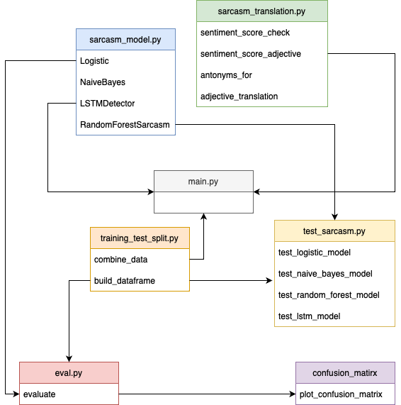

**Project Summary**
1. The goal of this project is to create a sarcasm detection and sarcasm translation model in Python, allowing end users to determine whether a text contains sarcasm.
2. It aims to aid users in better understanding sentences and discerning the true meaning of certain comments.

**Project Strucuture**
1. 'bin': This subfolder contains 'main.py', the primary program execution file. Further details will be covered in the subsequent section.
2. 'eval': This subfolder contains evaluation functions used to assess the performance of the sarcasm translation model. The 'eval' folder also stores metrics such as the confusion matrix, accuracy, precision, and recall scores for each model.
3. 'utils': This subfolder houses a function for splitting data into training and test sets. Initially, it merges the three available datasets and then divides the combined dataset into training and test sets using an 80/20 split.
4. 'sarcasm_model.py': This file encompasses the code for the defined sarcasm detection model. It includes four models:
    * Logistic Model
    * Naive Bayes Model
    * LSTM Model
    * Random Forest Model
Each model is equipped with an initialization function, a training function that takes the training file as input, and a test function that accepts specific inputs based on the model and returns predictions.
5. 'sarcasm_translation.py': This file houses the sarcasm translation model. It defines several functions, including sentiment score checking, utilizing POS tagging, finding antonyms, and replacing original text strings with new words. 
6. 'tests': The 'tests' subfolder comprises simple pytest test cases used to validate the functionality of our sarcasm detection model, ensuring that the returned outcomes align with expectations.
7. 'data': The 'data' subfolder contains the training data utilized to train each of the sarcasm detection models.

**Project Structure Diagram**

**Main.py**
1. The main software accepts three arguments:
    * -t: The text string the user wants to predict sarcasm for.
    * -m: The selected model to use, which can be "LG", "NB", "LSTM", "RF", or "All". If none of these options are selected, an error message will be returned.
    * -f: A flag indicating if the user wants to utilize the sarcasm translation model. If "T" is entered, the translation process will be conducted along with the prediction; otherwise, the prediction will be made without any translation.
2. The model will initially predict whether the text string contains sarcasm and print logging information presenting the prediction results to the user.
3. Depending on the flag and the prediction results, it will proceed to the sarcasm translation part.
4. Specific logging information will be generated based on the translation results.
5. **Important Note**: To effectively predict whether the text string is sarcastic or not, ensure that the input text is as lengthy as possible to provide more contextual information. Short, simple text strings are more likely to be predicted as sarcastic.

**Additional Notes**
1. Before running the code, change the directory to SARCASM, run "pip install ." at the sarcasm directory to import all the class functions.

2. When running the "main.py" file, remember to add "-t", "-m", "-f" as required inputs.